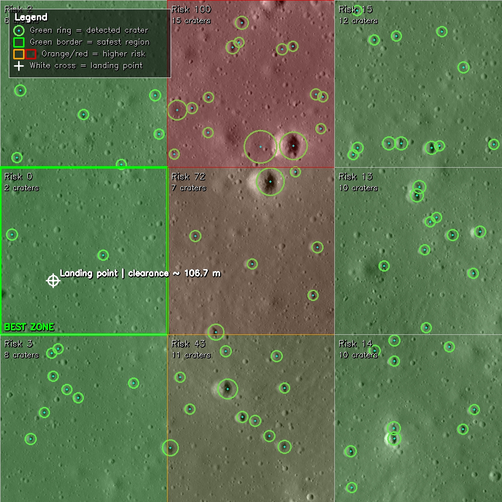

# ACDLR — Automated Crater Detection and Landing Risk

> Aplicação de visão computacional para detecção automática de crateras em imagens da superfície lunar e estimativa visual simplificada de risco de pouso.



---

## Sobre o projeto

O **ACDLR** é um projeto de visão computacional desenvolvido para detectar crateras em imagens da superfície lunar e gerar uma **análise visual simplificada de risco de pouso**.

A proposta do projeto não é reproduzir um sistema real de navegação espacial, mas sim construir uma ferramenta **didática, visual e interativa**, capaz de demonstrar como técnicas clássicas de processamento de imagens podem ser aplicadas à identificação automática de padrões e à geração de uma métrica simples de apoio à decisão.

O sistema recebe uma imagem lunar, realiza o pré-processamento, detecta crateras automaticamente, divide a imagem em regiões e calcula uma pontuação de risco baseada em características visuais observadas.

---

## Objetivo

O objetivo principal do projeto é:

- detectar crateras automaticamente em imagens lunares;
- analisar a distribuição espacial dessas crateras;
- estimar uma pontuação visual de risco por região;
- indicar a área mais favorável para pouso dentro da imagem analisada;
- apresentar os resultados de forma clara, interativa e visualmente forte.

---

## O que o sistema faz

O ACDLR executa as seguintes etapas:

1. **Recebe uma imagem da superfície lunar**
2. **Aplica pré-processamento**
   - conversão para tons de cinza;
   - suavização para redução de ruído;
   - realce de contraste, quando necessário;
3. **Detecta crateras automaticamente**
   - detecção de bordas;
   - identificação de padrões circulares;
   - filtragem geométrica de candidatos;
4. **Divide a imagem em regiões**
   - por exemplo, em uma grade 3x3;
5. **Calcula a pontuação de risco**
   - número de crateras;
   - tamanho médio estimado;
   - densidade de crateras por região;
6. **Exibe o resultado final**
   - imagem original;
   - crateras destacadas;
   - grade de análise;
   - pontuação de risco por região;
   - melhor região para pouso.

---

## Como funciona

O fluxo do projeto pode ser resumido da seguinte forma:

```text
Imagem lunar
   ↓
Pré-processamento
   ↓
Detecção de bordas e formas circulares
   ↓
Identificação das crateras
   ↓
Divisão da imagem em regiões
   ↓
Cálculo de risco por região
   ↓
Visualização final da análise
```

---

## Stack utilizada

**Linguagem principal**
- Python

**Bibliotecas**
- OpenCV
Responsável pela leitura das imagens, pré-processamento, detecção de bordas, operações morfológicas, identificação de crateras e anotação visual dos resultados.
- NumPy
Utilizado para manipulação de arrays, operações matriciais e apoio aos cálculos da pontuação de risco.
- Matplotlib
Pode ser usado para visualização de etapas intermediárias, comparação entre resultados e apoio à apresentação.
- Streamlit
Utilizado para construir a interface interativa, permitindo upload da imagem, execução do processamento e exibição imediata dos resultados.

---

## Dataset / dados utilizados

O projeto utiliza **imagens públicas da superfície lunar**, escolhidas pela qualidade visual e pela presença clara de crateras.

Para a execução prática e simples do projeto, a ideia é trabalhar com um conjunto de imagens estáticas de teste, suficiente para demonstrar:

entrada de imagens lunares;
detecção automática de crateras;
análise por regiões;
classificação visual de risco de pouso.

---

## Dataset utilizado no projeto
LROC NAC ROI_TORICELILOA (https://data.lroc.im-ldi.com/lroc/view_rdr/NAC_ROI_TORICELILOA)
Escala aproximada: 1.10 m/px

Isso permite, se desejado, converter medidas em pixels para uma estimativa física simples:
```text
metros = pixels * 1.10
```

---

## Funcionalidades principais
- upload de imagem lunar;
- pré-processamento automático;
- detecção de crateras por visão computacional clássica;
- grade de análise por regiões;
- cálculo de risco por região;
- destaque visual da área mais favorável para pouso;
- interface amigável para demonstração.

---

## Critérios da pontuação de risco

A pontuação de risco é uma métrica simplificada e didática, baseada em informações visuais extraídas da imagem.

Exemplos de critérios:

- quantidade de crateras detectadas em cada região;
- tamanho médio aproximado das crateras;
- densidade de crateras por área;
- distribuição espacial dos obstáculos.

>Observação: esta pontuação não representa uma medida física real de segurança espacial.Ela foi proposta como uma métrica visual coerente com o objetivo acadêmico do projeto.

---

## Saída esperada

Ao final da análise, o sistema deve exibir:

- a imagem original;
- a imagem com crateras marcadas;
- a grade de regiões;
- a pontuação de cada região;
- a classificação final de risco;
- a região sugerida como mais favorável para pouso.

---

## Diferencial do projeto

O diferencial do ACDLR está em transformar um problema clássico de detecção de crateras em uma aplicação:

- mais visual;
- mais intuitiva;
- mais interativa;
- mais adequada para apresentação acadêmica;
- mais original dentro do contexto de uma disciplina introdutória de visão computacional.

Em vez de apenas detectar crateras, o projeto organiza essa detecção como uma ferramenta de apoio visual à decisão.

---

## Possível pipeline de implementação

```text
1. Ler imagem
2. Converter para grayscale
3. Aplicar blur / suavização
4. Melhorar contraste
5. Detectar bordas
6. Detectar crateras
7. Filtrar falsos positivos
8. Dividir imagem em grade
9. Calcular score de risco por região
10. Exibir resultado final
```

---

## Como executar
1. Clone o repositório
```bash
git clone https://github.com/MarcosHGF/acdlr.git
cd acdlr
```

2. Crie e ative o ambiente virtual
```bash
python -m venv venv
```
    Windows
```bash
venv\Scripts\activate
```
    Linux / macOS
```bash
source venv/bin/activate
```
3. Instale as dependências
```bash
pip install -r requirements.txt
```
4. Usar dados da imagem padrao
```bash
python prepare_default_dataset.py --input caminho/para/sua_imagem_grande.png
```

4. Execute a aplicação
```bash
streamlit run app.py
```

---

## Exemplo de uso
- Abra a aplicação no navegador;
- Faça upload de uma imagem da superfície lunar;
- Execute o processamento;
- Visualize as crateras detectadas;
- Analise a pontuação de risco em cada região;
- Observe a região indicada como mais favorável para pouso.

---

## Tecnologias de referência

Este projeto foi inspirado e apoiado conceitualmente por referências como:

- Lunar Crater Detector
- DeepMoon
- OpenCV Hough Circle Transform
- OpenCV Canny Edge Detection
- Moon Crater Database

---

## Limitações
- não é um sistema real de navegação espacial;
- não substitui análise científica de terreno;
- a detecção depende da qualidade da imagem;
- pode haver falsos positivos e falsos negativos;
- a pontuação de risco é simplificada e didática.

---

## Licença

Este projeto é de caráter acadêmico e educacional.