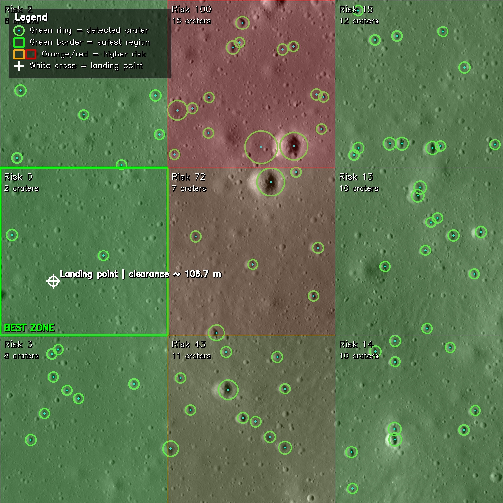

# ACDLR — Automated Crater Detection and Landing Risk

> Aplicação de visão computacional para detecção automática de crateras em imagens da superfície lunar e estimativa visual simplificada de risco de pouso.



---

## Sobre o projeto

O **ACDLR** é um projeto de visão computacional desenvolvido para detectar crateras em imagens da superfície lunar e gerar uma **análise visual simplificada de risco de pouso**.

A proposta do projeto não é reproduzir um sistema real de navegação espacial, mas sim construir uma ferramenta **didática, visual e interativa**, capaz de demonstrar como técnicas clássicas de processamento de imagens podem ser aplicadas à identificação automática de padrões e à geração de uma métrica simples de apoio à decisão.

O sistema recebe uma imagem lunar, realiza o pré-processamento, detecta crateras automaticamente, divide a imagem em regiões e calcula uma pontuação de risco baseada em características visuais observadas.

---

## Objetivo

O objetivo principal do projeto é:

- detectar crateras automaticamente em imagens lunares;
- analisar a distribuição espacial dessas crateras;
- estimar uma pontuação visual de risco por região;
- indicar a área mais favorável para pouso dentro da imagem analisada;
- apresentar os resultados de forma clara, interativa e visualmente forte.

---

## O que o sistema faz

O ACDLR executa as seguintes etapas:

1. **Recebe uma imagem da superfície lunar**
2. **Aplica pré-processamento**
   - conversão para tons de cinza;
   - suavização para redução de ruído;
   - realce de contraste, quando necessário;
3. **Detecta crateras automaticamente**
   - filtro casado multi-escala com assinatura visual de cratera;
   - geração de candidatos por máximos locais;
   - validação geométrica, fotométrica e por suporte de borda;
   - refinamento local por Hough apenas como ajuste final;
4. **Divide a imagem em regiões**
   - por exemplo, em uma grade 3x3;
5. **Calcula a pontuação de risco**
   - número de crateras;
   - tamanho médio estimado;
   - densidade de crateras por região;
6. **Exibe o resultado final**
   - imagem original;
   - crateras destacadas;
   - grade de análise;
   - pontuação de risco por região;
   - melhor região para pouso.

---

## Como funciona

O fluxo do projeto pode ser resumido da seguinte forma:

```text
Imagem lunar
   ↓
Pré-processamento
   ↓
Filtro casado multi-escala e validação geométrica/fotométrica
   ↓
Identificação das crateras
   ↓
Divisão da imagem em regiões
   ↓
Cálculo de risco por região
   ↓
Visualização final da análise
```

---

## Stack utilizada

**Linguagem principal**
- Python

**Bibliotecas**
- OpenCV
Responsável pela leitura das imagens, pré-processamento, filtros clássicos, detecção de bordas, refinamento geométrico e anotação visual dos resultados.
- NumPy
Utilizado para manipulação de arrays, operações matriciais e apoio aos cálculos da pontuação de risco.
- Matplotlib
Pode ser usado para visualização de etapas intermediárias, comparação entre resultados e apoio à apresentação.
- Streamlit
Utilizado para construir a interface interativa, permitindo upload da imagem, execução do processamento e exibição imediata dos resultados.

---

## Dataset / dados utilizados

O projeto utiliza **imagens públicas da superfície lunar**, escolhidas pela qualidade visual e pela presença clara de crateras.

Para a execução prática e simples do projeto, a ideia é trabalhar com um conjunto de imagens estáticas de teste, suficiente para demonstrar:

entrada de imagens lunares;
detecção automática de crateras;
análise por regiões;
classificação visual de risco de pouso.

---

## Dataset utilizado no projeto
LROC NAC ROI_TORICELILOA (https://data.lroc.im-ldi.com/lroc/view_rdr/NAC_ROI_TORICELILOA)
Escala aproximada: 1.10 m/px

Isso permite, se desejado, converter medidas em pixels para uma estimativa física simples:
```text
metros = pixels * 1.10
```

---

## Funcionalidades principais
- upload de imagem lunar;
- pré-processamento automático;
- detecção de crateras por visão computacional clássica;
- grade de análise por regiões;
- cálculo de risco por região;
- destaque visual da área mais favorável para pouso;
- interface amigável para demonstração.

---

## Critérios da pontuação de risco

A pontuação de risco é uma métrica simplificada e didática, baseada em informações visuais extraídas da imagem.

Exemplos de critérios:

- quantidade de crateras detectadas em cada região;
- tamanho médio aproximado das crateras;
- densidade de crateras por área;
- maior cratera detectada na região;
- cobertura estimada das crateras sobre a célula;
- distância livre sugerida para o ponto de pouso;
- distribuição espacial dos obstáculos.

O score atual usa componentes físicos limitados em uma escala de 0 a 100, em vez de normalizar sempre a imagem para que alguma região seja obrigatoriamente "100". Isso ajuda a comparar tiles diferentes de forma mais coerente.

Modelo atual:

| Componente | Peso máximo | Saturação didática |
|---|---:|---:|
| Densidade de crateras | 30 pontos | 120 crateras/km² |
| Diâmetro médio | 20 pontos | 80 m |
| Maior diâmetro | 35 pontos | 140 m |
| Cobertura por crateras | 15 pontos | 8% da célula |

Esses valores não representam critérios oficiais de pouso lunar. Eles são limites interpretáveis para uma aplicação acadêmica e podem ser recalibrados quando houver mais tiles anotados.

> Observação: esta pontuação não representa uma medida física real de segurança espacial. Ela foi proposta como uma métrica visual coerente com o objetivo acadêmico do projeto.

---

## Saída esperada

Ao final da análise, o sistema deve exibir:

- a imagem original;
- a imagem com crateras marcadas;
- a grade de regiões;
- a pontuação de cada região;
- a classificação final de risco;
- a região sugerida como mais favorável para pouso.

---

## Diferencial do projeto

O diferencial do ACDLR está em transformar um problema clássico de detecção de crateras em uma aplicação:

- mais visual;
- mais intuitiva;
- mais interativa;
- mais adequada para apresentação acadêmica;
- mais original dentro do contexto de uma disciplina introdutória de visão computacional.

Em vez de apenas detectar crateras, o projeto organiza essa detecção como uma ferramenta de apoio visual à decisão.

---

## Comparação com DeepMoon

O ACDLR não incorpora deep learning no pipeline. A comparação neural do projeto fica restrita ao **DeepMoon**, repositório de Ari Silburt e colaboradores para identificação de crateras lunares por CNN: https://github.com/silburt/DeepMoon.

O paper associado, **Lunar Crater Identification via Deep Learning**, descreve o DeepMoon como um pipeline baseado em DEMs lunares. Ele treina uma CNN inspirada na arquitetura U-Net para prever máscaras binárias de aros de crateras e depois usa template matching para extrair centro e raio das crateras detectadas.

| Critério | ACDLR | DeepMoon |
|---|---|---|
| Entrada | Imagens/tiles visuais da superfície lunar | Recortes de DEM lunar global |
| Método central | Visão computacional clássica com CLAHE, filtro casado, bordas e validação geométrica/fotométrica | CNN baseada em U-Net para prever máscaras de aros de crateras |
| Treinamento | Não exige treinamento; os parâmetros são explícitos | Exige catálogo anotado, geração de targets e treinamento em GPU |
| Extração de crateras | Candidatos circulares são validados diretamente no tile | A CNN prevê a máscara e uma etapa posterior extrai `(x, y, r)` por template matching |
| Métricas comparáveis | Precisão, recall, F1, erro de centro e erro de raio em tiles anotados | Precisão, recall, F1 e erros fracionários de longitude, latitude e raio |
| Papel no projeto | Ferramenta didática, visual e explicável para risco de pouso | Referência científica neural para extração automática de catálogos de crateras |

No paper, o DeepMoon reporta recall pós-processado de 92% no conjunto de teste, precisão pós-processada de 56%, erro fracionário mediano de raio de 7% e uma estimativa de 11% de falsos positivos em uma inspeção manual de novas crateras. Esses resultados são a referência de ambição, não uma dependência do ACDLR.

O ponto principal da comparação é: **DeepMoon aprende padrões por treinamento; ACDLR explicita os critérios visuais e geométricos**. Por isso, a evolução do ACDLR deve mirar métricas semelhantes, mantendo o método clássico.

A interface do Streamlit exibe essa comparação em três níveis:

- resumo metodológico ACDLR x DeepMoon;
- comparação de pipeline, da entrada até a saída;
- alinhamento das métricas do DeepMoon com os campos gerados pelo benchmark clássico do ACDLR;
- limitações e ameaças à validade da comparação.

---

## Roteiro de evolução sem incorporar DeepMoon

1. Criar um pequeno benchmark anotado manualmente com tiles do LROC NAC ROI_TORICELILOA.
2. Medir métricas inspiradas no DeepMoon: precisão, recall, F1, erro médio de centro e erro médio de raio.
3. Ajustar o detector clássico usando esses resultados, não apenas inspeção visual.
4. Tornar o score de risco mais absoluto e comparável entre imagens.
5. Exibir na interface uma comparação metodológica direta entre ACDLR e DeepMoon.
6. Documentar limitações com honestidade: iluminação, sombras, crateras degradadas e falsos positivos.

---

## Benchmark clássico inspirado no DeepMoon

O repositório inclui um script para avaliar o pipeline clássico contra anotações manuais usando métricas próximas às usadas pelo DeepMoon:

```bash
python benchmark_classical.py --images-dir data/lroc_nac_roi_toriceliloa_tiles --annotations-dir data/annotations
```

O relatório gerado inclui:

- precisão;
- recall;
- F1;
- erro médio de centro em pixels;
- erro médio de centro normalizado pelo raio anotado;
- erro médio de raio em pixels;
- erro médio de raio normalizado pelo raio anotado.

Para cada imagem, crie um arquivo de anotação com o mesmo nome-base:

```text
data/lroc_nac_roi_toriceliloa_tiles/torricelli_y00000_x00000.png
data/annotations/torricelli_y00000_x00000.csv
```

Formato CSV aceito:

```csv
cx,cy,radius_px
512,438,22
610,701,14
```

Também é aceito JSON como lista de objetos ou objeto com chave `craters`.

---

## Ajuste do detector clássico

Depois de criar anotações manuais, a etapa seguinte é ajustar os parâmetros do detector com evidência quantitativa. O script abaixo executa uma busca em grade e ordena os resultados por F1, seguindo a mesma lógica geral usada pelo DeepMoon para escolher hiperparâmetros em validação.

```bash
python tune_classical.py --images-dir data/lroc_nac_roi_toriceliloa_tiles --annotations-dir data/annotations
```

Exemplo com faixas personalizadas:

```bash
python tune_classical.py ^
  --images-dir data/lroc_nac_roi_toriceliloa_tiles ^
  --annotations-dir data/annotations ^
  --min-radius-values 8,10,12 ^
  --max-radius-values 35,40,50 ^
  --canny-threshold-values 50,60,70 ^
  --strictness-values 28,34,40
```

O arquivo `tuning_results.csv` mostra os conjuntos de parâmetros ranqueados. A escolha recomendada é começar pelo maior F1 e, em caso de empate, preferir menor erro normalizado de centro e raio.

---

## Possível pipeline de implementação

```text
1. Ler imagem
2. Converter para grayscale
3. Aplicar blur / suavização
4. Melhorar contraste com CLAHE
5. Aplicar filtro casado multi-escala
6. Gerar candidatos a crateras
7. Validar centro, raio, contraste, aro e suporte de borda
8. Refinar localmente e remover duplicatas
9. Dividir imagem em grade
10. Calcular score de risco por região
11. Sugerir ponto de pouso por distância livre
12. Exibir resultado final
```

---

## Como executar
1. Clone o repositório
```bash
git clone https://github.com/MarcosHGF/acdlr.git
cd acdlr
```

2. Crie e ative o ambiente virtual
```bash
python -m venv venv
```
    Windows
```bash
venv\Scripts\activate
```
    Linux / macOS
```bash
source venv/bin/activate
```
3. Instale as dependências
```bash
pip install -r requirements.txt
```
4. Gerar tiles a partir de uma imagem grande
```bash
python prepare_default_dataset.py --input caminho/para/sua_imagem_grande.png
```

Para reproduzir a validacao feita com o dataset oficial LROC
NAC_ROI_TORICELILOA, use o produto 5M:

```bash
python prepare_default_dataset.py --input data/raw/NAC_ROI_TORICELILOA_E047S0284_5M.TIF --tile-size 1024 --overlap 64 --prefix torricelli_5m
python scripts/validate_lroc_toricelli_dataset.py --images-dir data/lroc_nac_roi_toriceliloa_tiles --out-dir artifacts/toricelli_validation --scale-m-per-px 5.0
```

O script salva um CSV descritivo, um relatorio Markdown e prints em:

```text
artifacts/toricelli_validation/
```

5. Execute a aplicação
```bash
streamlit run app.py
```

6. Opcionalmente, rode o benchmark com anotações manuais
```bash
python benchmark_classical.py --images-dir data/lroc_nac_roi_toriceliloa_tiles --annotations-dir data/annotations
```

7. Ajuste os parâmetros do detector a partir das métricas
```bash
python tune_classical.py --images-dir data/lroc_nac_roi_toriceliloa_tiles --annotations-dir data/annotations
```

---

## Exemplo de uso
- Abra a aplicação no navegador;
- Faça upload de uma imagem da superfície lunar;
- Execute o processamento;
- Visualize as crateras detectadas;
- Analise a pontuação de risco em cada região;
- Observe a região indicada como mais favorável para pouso.

---

## Tecnologias de referência

Este projeto foi inspirado e apoiado conceitualmente por referências como:

- Lunar Crater Detector
- DeepMoon / CNN para crateras lunares
- OpenCV Hough Circle Transform
- OpenCV Canny Edge Detection
- Moon Crater Database

---

## Limitações e ameaças à validade

O ACDLR é uma ferramenta acadêmica de demonstração. A comparação com o DeepMoon ajuda a organizar a avaliação, mas não transforma o projeto em um sistema científico equivalente ao DeepMoon nem em uma solução real de navegação.

| Área | Limitação | Impacto | Mitigação |
|---|---|---|---|
| Comparação com DeepMoon | DeepMoon usa DEMs lunares; ACDLR usa imagens/tiles visuais | Os números dos dois sistemas não são diretamente intercambiáveis | Comparar método, métricas e protocolo; evitar alegar equivalência direta |
| Benchmark | O conjunto local anotado ainda precisa ser criado | A comparação permanece metodológica até haver anotações | Anotar tiles e reportar precisão, recall, F1 e erros normalizados |
| Detecção | Sombras, iluminação lateral, crateras degradadas e textura do relevo podem confundir o detector | Pode haver falsos positivos e falsos negativos | Ajustar parâmetros com validação anotada e registrar casos de erro |
| Escala | Medidas físicas dependem do valor de metros por pixel | O score de risco muda se a escala estiver incorreta | Usar a escala correta do dataset antes de comparar tiles |
| Score de risco | A pontuação é didática e simplificada | Não certifica segurança real de pouso | Apresentar como apoio visual à decisão, não como métrica operacional |
| Validação | Ajustar e avaliar no mesmo conjunto pequeno pode gerar overfitting | Resultados podem parecer melhores do que a generalização real | Separar tiles anotados em validação e teste |
| Cobertura do terreno | O sistema considera crateras detectadas, mas não modela rochas, inclinação real, propriedades do regolito ou iluminação operacional | A região sugerida pode ignorar riscos físicos não visíveis no pipeline | Declarar escopo visual e não substituir análise geológica/engenharia |

---

## Licença

Este projeto é de caráter acadêmico e educacional.
